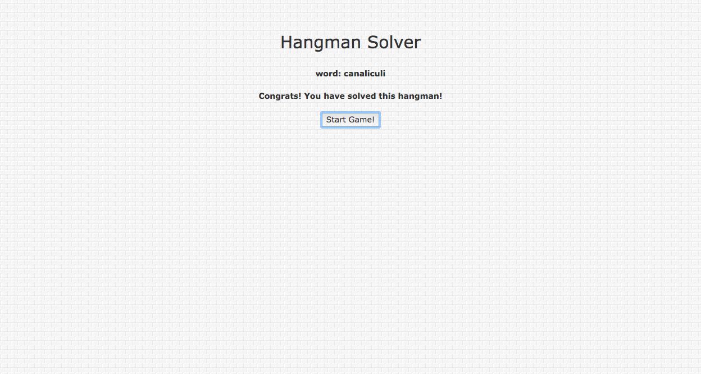
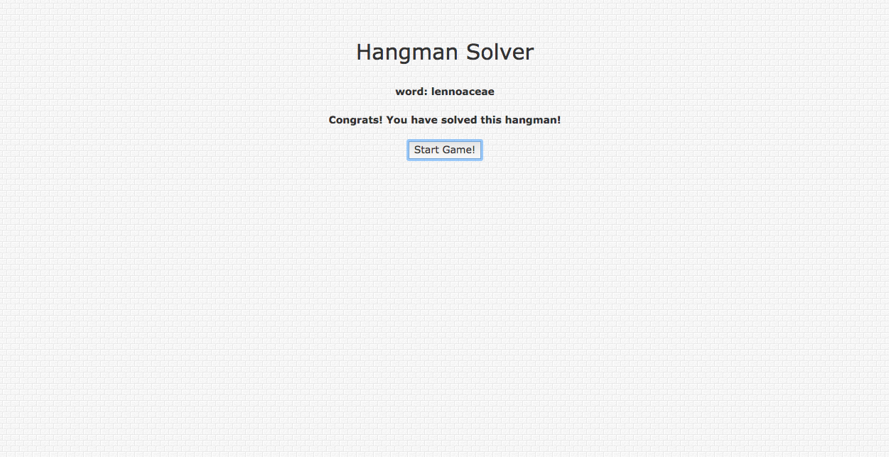
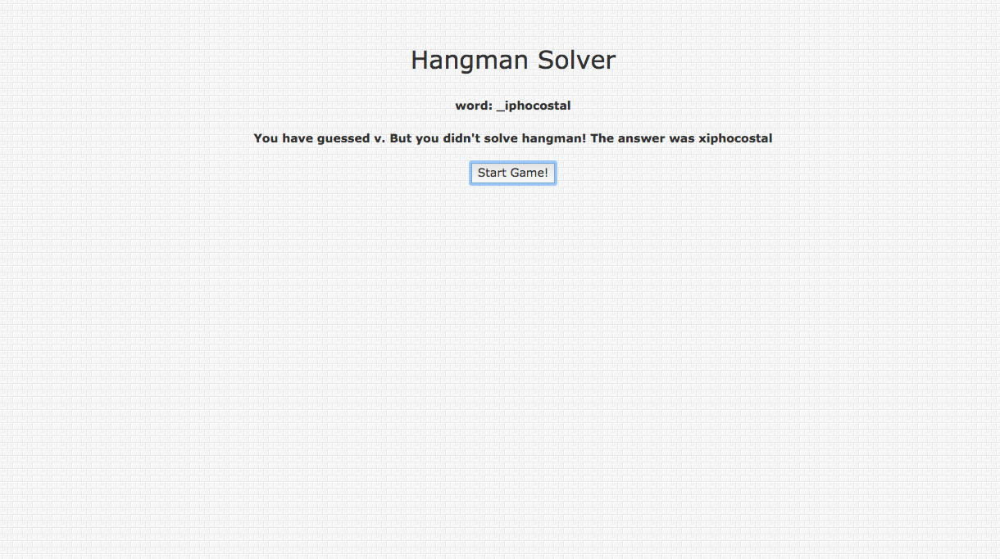
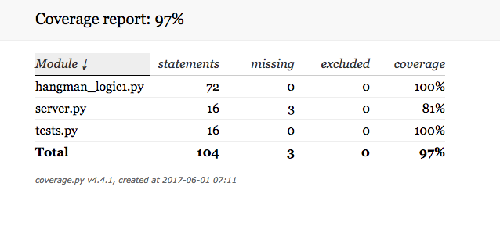

# hangman-solver

Hangman Solver is a web app that solves the hangman game on average 44.8% of the time consistently.
 
---
 
## Features and Coverage
 
1) Integrate with 3 API endpoints to start a game, play a game, and check status of a game
2) Functionality to pattern match known letters/indexes of game word with words in the English language from Python's NLTK 'word' corpus
3) UI - display won/lost message to user along with complete/incomplete word
4) 97% unit/integration test coverage
---

## Design Methodology

1) Choose character from list of most frequenly used letters in the English language until a first letter match
2) Compare letter(s) and letter indexes to word list drawn in from NLTK with words of same length as game word
3) Make list of most frequently used letters from refined list of potential words
4) In each iteration, potential word list is refined, as well as most frequently used letters of words in potential word list

---

## Web App Screen Shots
 

### Homepage: game 1

 

### Homepage: game 2
 

### Homepage: game 3
 

 

### Test Coverage
 

 

### Languages
Python, JavaScript, HTML, CSS
 
### Technologies
Flask, NLTK
JQuery, AJAX, 
virtualenv
 

---
